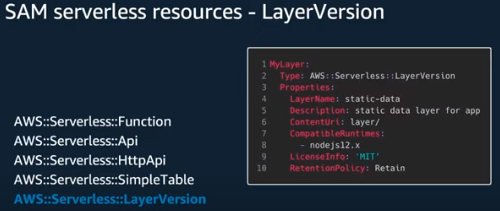

# AWS SAM 
Based on [Mastering the AWS Serverless Application Model (AWS SAM) - AWS Online Tech Talks](https://www.youtube.com/watch?v=QBBewrKR1qg&t=365s)

## Note:
- If SAM command is not working:
```sh
alias sam="sam.cmd" 
sam --version
```

## Part 1 - AWS SAM Templates


### Lambda Functions


### API GW - Type=API

- You can use OpenAPI (swaggers) to define the API


### API GW - HTTP API (or API GW v2) 
- **It is meant to be faster, lower cost and easiesr to use**
 

### LayerVersion
- Layers allow you to **share code accross multiple Lambda functions**

 
 

### AWS SAM Globals
- The problem: repetition of code
 
- The solution: defining global variables


## Buidling Reusable Templates
- As a best practice, each environment should have its own account
- Using the same template to build the same infrastructure ensures consistency accross all the accounts

- There are several ways to achieve it:
  1. Using **Parameters**
   - The parameters can be stored on the Template itself or on **SSM** or on **Secrets Manager** services


Example:
```yaml
AWSTemplateFormatVersion: '2010-09-09'
Transform: AWS::Serverless-2016-10-31
Description: module3-controller
Parameters:
  DynamoDBTableName:
    Type: AWS::SSM::Parameter::Value<String>
    Default: themeParkMainTable
    Description: Main Theme Park app table
  IOTendpoint:
    Type: String
    Description: Theme Park IoT endpoint

```


Example:
```js
  ControllerFunction:
    Type: AWS::Serverless::Function # More info about Function Resource: https://github.com/awslabs/serverless-application-model/blob/master/versions/2016-10-31.md#awsserverlessfunction
    Properties:
      CodeUri: controller/
      Handler: app.handler
      MemorySize: 128
      Runtime: nodejs12.x
      Environment:
        Variables:
          DDB_TABLE_NAME: !Ref DynamoDBTableName
          IOT_DATA_ENDPOINT: !Ref IOTendpoint
          IOT_TOPIC: 'theme-park-rides'
          DB_NAME: '{resolve:ssm:/myApp/DbName:1}'
          DB_USER: '{resolve:secretsManager:/myApp/DbCreds/SecretString:UserName}'
          DB_PASS: '{resolve:secretsManager:/myApp/DbCreds/SecretString:UserPass}'
```
## Pseudo Parameters


We can use even Intrinsic Functions (similar to the ones used by CloudFormation)


Example:


## Part 2 - AWS SAM CLI


### 1. SAM init


As a result, a new project is created:


### 2. SAM build


The result will be:


- Once the build is done and **artifacts** are created there are some commands you can use next:
* Validate SAM template: **sam validate**
* Invoke Function: **sam local invoke**
* Test Function in the Cloud: **sam sync --stack-name {{stack-name}} --watch**
* Deploy: **sam deploy --guided**

```sh
sam local invoke InitStateFunction
```

### 3. SAM deploy
- It will upload the artifacts into an S3 bucket and then trigger a cloudFormation build


### Additional commands:
#### SAM package 
- this command can be used for creating a zip file that is uploaded to an S3 bucket. 
- It can be useful if there is a CI/CD pipeline that is involved in the build and deployment
proccesses.
```sh
sam package --s3-bucket ej-apps --output-template-file out.yaml
```

#### SAM local generate-event
- This command generates a JSON object representing the output from a given service and type


```sh
sam local generate-event apigateway http-api-proxy
sam local generate-event s3 put
```

#### SAM local start-api
- Emulate a REST API call to a Lambda function


Useful options


#### SAM local start-lambda
- this is less helpful, unless you are building a service that calls the Lambda function directly.
- you can also use the AWS CLI (aws lambda invoke --function-name "" --endpoint-url "" --no-verify-ssl out.txt)

#### SAM local invoke lambda
```sh
sam local invoke HelloWorld -e events/event.json
```


- SAM local is "build" aware so pay attention which template.yaml is being used. The manifest under ./aws-sam/build/template.yaml always takes precedence 

#### SAM logs
- This command can replace the need to continuosly watch CloudWatch logs


### Debugging locally on VS Code


## Additional Materials
### Calling a Lambda function once CloudFormation Deploy is done:
(example)[https://github.com/stelligent/cloudformation-custom-resources/blob/master/lambda/nodejs/customresource.js] 

```yaml
  # Lambda function for initializing DDB table content
  AppConfigurationLambda:
    Type: AWS::Serverless::Function
    Properties:
      CodeUri: initDB/
      Handler: app.handler
      Runtime: nodejs12.x
      Timeout: 15
      MemorySize: 128
      Environment:
        Variables:
          DDBtable: !Ref DDBtable
      Policies:
        - DynamoDBCrudPolicy:
            TableName: !Ref DDBtable                 

  # Triggers Lambda function after stack creation to add rides to DDB
  DeploymentCustomResource:
    Type: Custom::AppConfiguration
    Properties:
      ServiceToken: !GetAtt AppConfigurationLambda.Arn
```
### Lambda function for CRUD DynamoDB actions + API GW    

 (Lambda function from CRUD DynamoDB)[https://docs.aws.amazon.com/apigateway/latest/developerguide/http-api-dynamo-db.html]

```js
import { DynamoDBClient } from "@aws-sdk/client-dynamodb";
import {
  DynamoDBDocumentClient,
  ScanCommand,
  PutCommand,
  GetCommand,
  DeleteCommand,
} from "@aws-sdk/lib-dynamodb";

const client = new DynamoDBClient({});

const dynamo = DynamoDBDocumentClient.from(client);

const tableName = "http-crud-tutorial-items";

export const handler = async (event, context) => {
  let body;
  let statusCode = 200;
  const headers = {
    "Content-Type": "application/json",
  };

  try {
    switch (event.routeKey) {
      case "DELETE /items/{id}":
        await dynamo.send(
          new DeleteCommand({
            TableName: tableName,
            Key: {
              id: event.pathParameters.id,
            },
          })
        );
        body = `Deleted item ${event.pathParameters.id}`;
        break;
      case "GET /items/{id}":
        body = await dynamo.send(
          new GetCommand({
            TableName: tableName,
            Key: {
              id: event.pathParameters.id,
            },
          })
        );
        body = body.Item;
        break;
      case "GET /items":
        body = await dynamo.send(
          new ScanCommand({ TableName: tableName })
        );
        body = body.Items;
        break;
      case "PUT /items":
        let requestJSON = JSON.parse(event.body);
        await dynamo.send(
          new PutCommand({
            TableName: tableName,
            Item: {
              id: requestJSON.id,
              price: requestJSON.price,
              name: requestJSON.name,
            },
          })
        );
        body = `Put item ${requestJSON.id}`;
        break;
      default:
        throw new Error(`Unsupported route: "${event.routeKey}"`);
    }
  } catch (err) {
    statusCode = 400;
    body = err.message;
  } finally {
    body = JSON.stringify(body);
  }

  return {
    statusCode,
    body,
    headers,
  };
};
```

- This lambda function should have 4 routes defined under API GW

```js
GET /items/{id}
GET /items
PUT /items
DELETE /items/{id}
```

- Testing the Integration

```sh
curl -X "PUT" -H "Content-Type: application/json" -d "{\"id\": \"123\", \"price\": 12345, \"name\": \"myitem\"}" https://abcdef123.execute-api.us-west-2.amazonaws.com/items

curl https://abcdef123.execute-api.us-west-2.amazonaws.com/items/123

curl -X "DELETE" https://abcdef123.execute-api.us-west-2.amazonaws.com/items/123
```

All the above can be automated with the [SAM template under](./http-dynamo-tutorial/template.yaml)

### AWS SAM template for a DynamoDB application based on Lambda Function
(AWS SAM template for a DynamoDB application)[https://docs.aws.amazon.com/lambda/latest/dg/kinesis-tutorial-spec.html]

Example template.yaml

```js
AWSTemplateFormatVersion: '2010-09-09'
Transform: AWS::Serverless-2016-10-31
Resources:
  ProcessDynamoDBStream:
    Type: AWS::Serverless::Function
    Properties:
      Handler: handler
      Runtime: runtime
      Policies: AWSLambdaDynamoDBExecutionRole
      Events:
        Stream:
          Type: DynamoDB
          Properties:
            Stream: !GetAtt DynamoDBTable.StreamArn
            BatchSize: 100
            StartingPosition: TRIM_HORIZON

  DynamoDBTable:
    Type: AWS::DynamoDB::Table
    Properties: 
      AttributeDefinitions: 
        - AttributeName: id
          AttributeType: S
      KeySchema: 
        - AttributeName: id
          KeyType: HASH
      ProvisionedThroughput: 
        ReadCapacityUnits: 5
        WriteCapacityUnits: 5
      StreamSpecification:
        StreamViewType: NEW_IMAGE
``` 
### Additional Resources:
(choosing-between-messaging-services-for-serverless-applications)[https://aws.amazon.com/blogs/compute/choosing-between-messaging-services-for-serverless-applications/]

- The above article contains also examples of SAM Template.yaml files for **SQS**, **SNS** and **EventBridge** services and sample **Lambda functions** for using those services.

#### EventBridge SAM  Lambda-to-Lambda Example:
https://github.com/jbesw/eventbridge-sam-example

- SAM type for Eventbridge: AWS::Events::Rule

./template.yaml:
```yaml
AWSTemplateFormatVersion: '2010-09-09'
Transform: AWS::Serverless-2016-10-31
Description: Event Bridge Demo
  
Globals:
  Function:
    Timeout: 3

Resources:
  orderServiceFunction:
    Type: AWS::Serverless::Function
    Properties:
      CodeUri: orderService/
      Handler: app.lambdaHandler
      Runtime: nodejs12.x
      Policies:
        - Statement:
          - Effect: Allow
            Resource: '*'
            Action:
              - events:PutEvents      

  invoiceServiceFunction:
    Type: AWS::Serverless::Function
    Properties:
      CodeUri: invoiceService/
      Handler: app.lambdaHandler
      Runtime: nodejs12.x

  EventRule: 
    Type: AWS::Events::Rule
    Properties: 
      Description: "EventRule"
      EventPattern: 
        source: 
          - "demo.orders"
        detail: 
          state: 
            - "created"
      State: "ENABLED"
      Targets: 
        - 
          Arn: 
            Fn::GetAtt: 
              - "invoiceServiceFunction"
              - "Arn"
          Id: "invoiceServiceTarget"

  PermissionForEventsToInvokeLambda: 
    Type: AWS::Lambda::Permission
    Properties: 
      FunctionName: 
        Ref: "invoiceServiceFunction"
      Action: "lambda:InvokeFunction"
      Principal: "events.amazonaws.com"
      SourceArn: 
        Fn::GetAtt: 
          - "EventRule"
          - "Arn"
```

